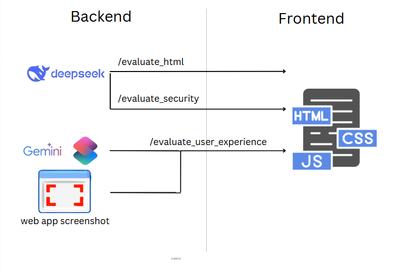

# <p align="center" style="font-size: 60px;"><strong>Auto_QA</strong></p>

<p align="center">
  <a href="#overview">Overview</a> |
  <a href="#functionalities">Functionalities</a> | 
  <a href="#architecture">Architecture</a> | 
  <a href="#installation">Installation Guide</a>
</p>

---

## Overview

The **Auto_QA** project is designed to evaluate websites from a quality assurance (QA) perspective based on a provided URL. QA feedback is essential for improving software quality, and automating this process can significantly accelerate the software development lifecycle. By leveraging advanced language models, Auto_QA provides actionable insights to enhance website quality.

---

## Functionalities

As an initial version, the Auto_QA system evaluates the following key criteria:

1. **HTML Code Quality and Bugs**:  
   Analyzes the structure and quality of the HTML code, identifying potential bugs or inefficiencies.

2. **User Experience (UX)**:  
   Evaluates the front-end design, usability, and overall user experience from a client perspective.

3. **Security**:  
   Assesses the website's ability to protect data by analyzing headers and identifying vulnerabilities to malicious attacks.

---

## Architecture

The project leverages the power of **Large Language Models (LLMs)** to automate feedback generation. Currently, the system utilizes two models: **DeepSeek** and **Gemini**. Below is a high-level overview of the system architecture:

<div style="text-align:center">
    
</div>

---

## Installation Guide

The repository is designed to be user-friendly, allowing you to test the project locally or build upon it. Follow these steps to set up and run the application:

1. **Clone the Repository**:
   ```bash
   git clone https://github.com/your-username/Auto_QA.git
   cd Auto_QA
2. **Install Required Libraries**:
   Install the dependencies listed in the requirements.txt file:
   ```bash
    pip install -r requirements.txt

3. **Set Up API Keys**:
   Create an account on [OpenRouter](https://openrouter.ai/) and generate an API key.
   Replace the placeholder in the .env file with your API key. This file contains all necessary environment variables.
4. **Run the Application**:
    Start the backend server by running the app.py file:
    ```bash
    python ./Backend/app.py

5. **Access the Web Interface**:
    Open your browser and navigate to the provided localhost URL to start experimenting with the application.
